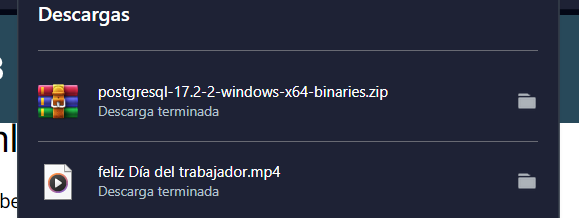
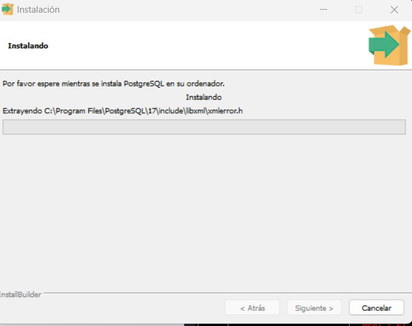
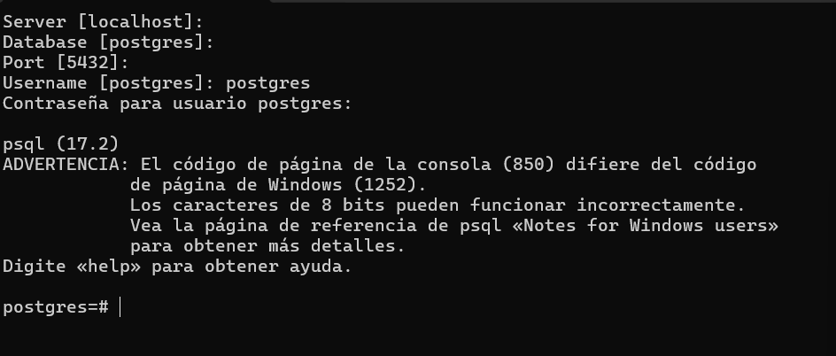
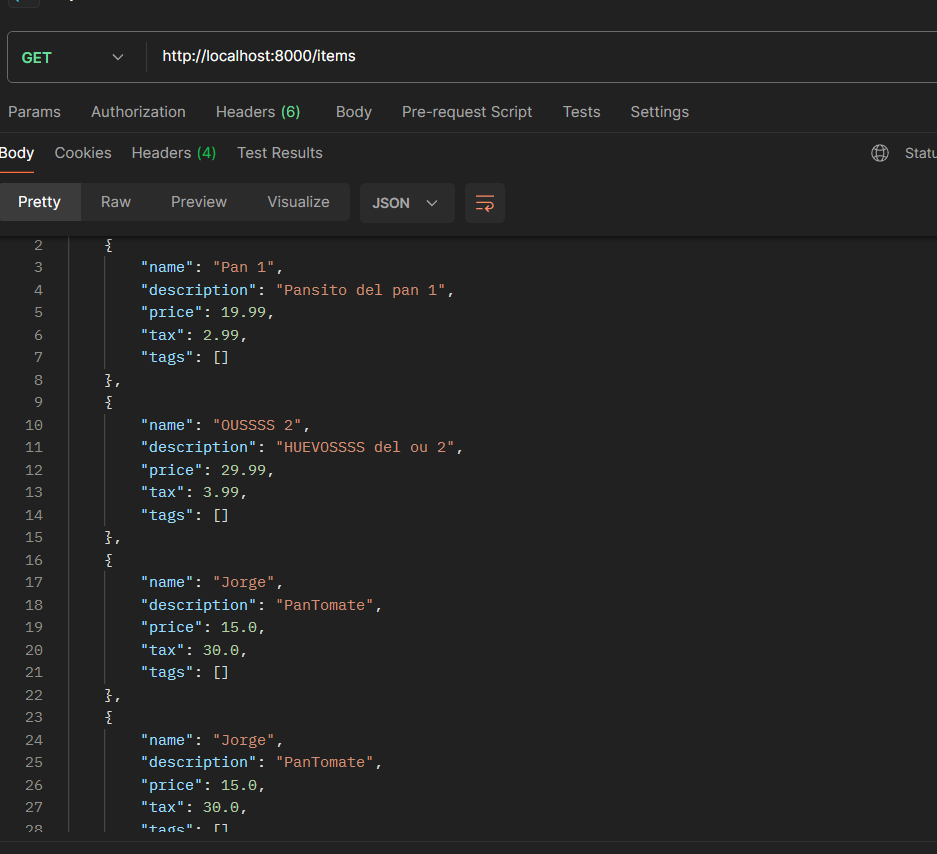
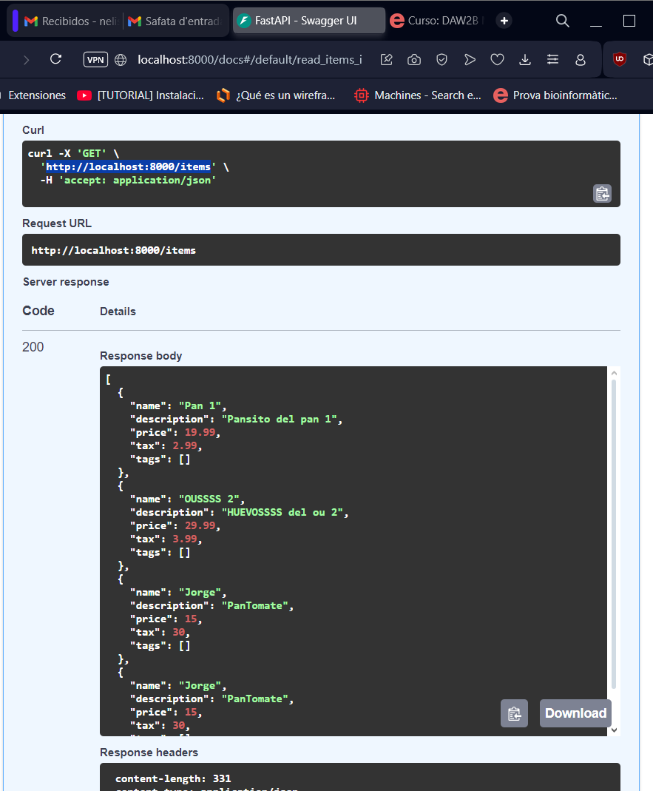
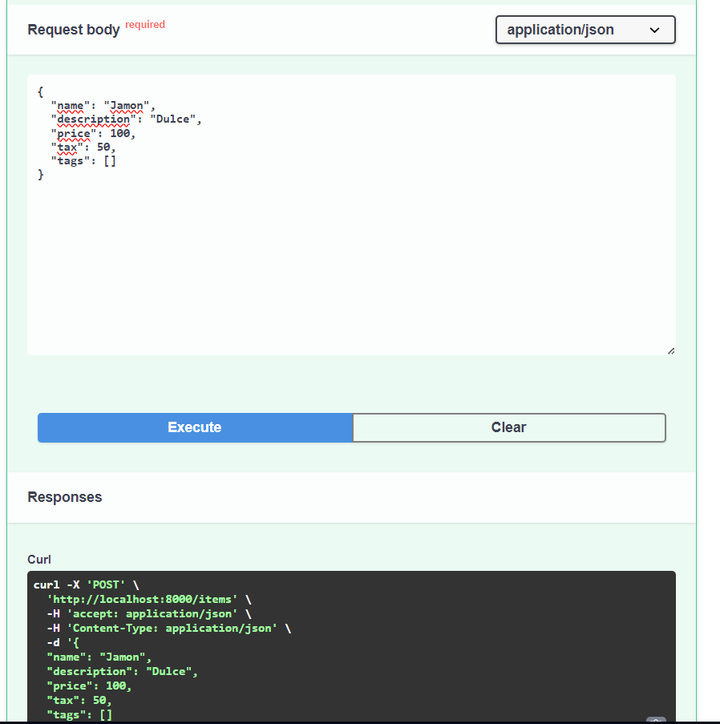
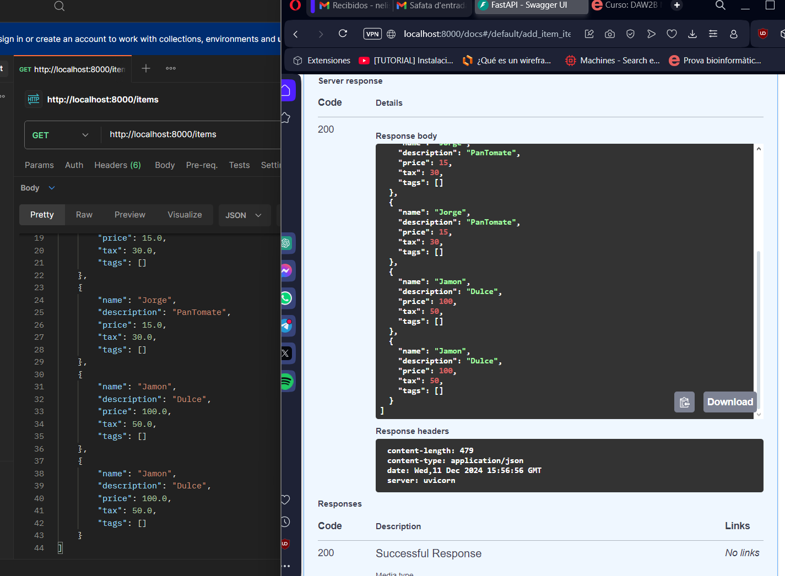

# ACTIVITAT_9
Primer commit de confirmación

# Proyecto FastAPI con PostgreSQL

Este proyecto implementa una API RESTful usando FastAPI que se conecta a una base de datos PostgreSQL para realizar operaciones CRUD (Crear, Leer, Actualizar, Eliminar) sobre un conjunto de datos.

La API permite gestionar items con los siguientes atributos:

- `name`: Nombre del item
- `description`: Descripción opcional del item
- `price`: Precio del item
- `tax`: Impuesto opcional asociado al item
- `tags`: Lista de etiquetas asociadas al item

## Requisitos

- **Python 3.8+**: Versión de Python necesaria para ejecutar el proyecto.
- **PostgreSQL**: Base de datos relacional utilizada para almacenar los datos.
- **FastAPI**: Framework de Python para construir APIs web rápidas y eficaces.
- **Uvicorn**: Servidor ASGI recomendado para ejecutar aplicaciones FastAPI.
- **psycopg2**: Librería de Python para interactuar con bases de datos PostgreSQL.
- **pydantic**: Librería para la validación y manejo de datos con modelos en Python.

## Instalación

Estructura del Proyecto
El proyecto está organizado de la siguiente manera:

crud.py: Contiene las funciones para obtener y crear items en la base de datos.
database.py: Define la función para establecer la conexión con la base de datos PostgreSQL utilizando psycopg2.
models.py: Define los esquemas de los datos utilizando Pydantic, que se utilizan para la validación y serialización de datos.
main.py: Define los endpoints de la API, incluyendo la consulta y la creación de items.
requirements.txt: Contiene las dependencias necesarias para el proyecto.
Tareas Realizadas

## Pruebas Realizadas

Instalacion de ultima version PostgresSQL

Instalacion de .exe de PostgresSQL

Creacion y conexion de base de datos PSQL

Pruebas De FASTAAPI

Pruebas De FASTAAPI

Pruebas De FASTAAPI

Pruebas De FASTAAPI

